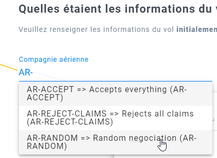

# What is this section ?

It contains some tips & tricks to test justice.cool.

# Create a mediation against yourself

If you are a defender company, and you would like to test your implementation of the `new mediation` hook,
or if you are a demander company curious to know what is the experience of defender companies,
then it is likely that you will have to create new mediations against yourself.

### To do so:

- Head to the [test tools section](https://app.staging.justice.cool/dev/test-tools) of our sandboxed environment
- Click on "create a test mediation"

... this will create a mediation with your account as opponent, and with a fake demander (see [autoresponders](/auto-responders.md))

# Test a whole mediation process without any API, as demander

You can fill [the demander initial form](https://app.staging.justice.cool/form?reset=true).

One problem, though: the opponent you choose will not be notified, and nobody will answer you.

To fix this, you can use an [autoresponder](/auto-responders.md) as your opponent.

For instance, when filling a test aerial litigation, you would have to choose an autoresponder as opponent airline:

Then, each time you finish a form, these simple robot opponent will be activated and act as if you had an opponent.
You will have to refresh your page a couple of seconds after your last action to see their answer.